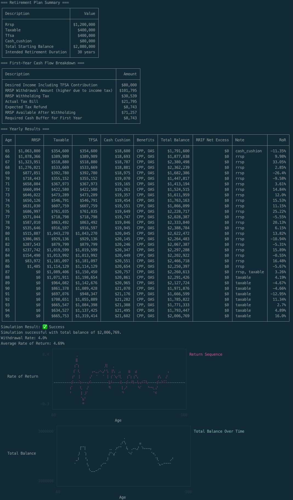
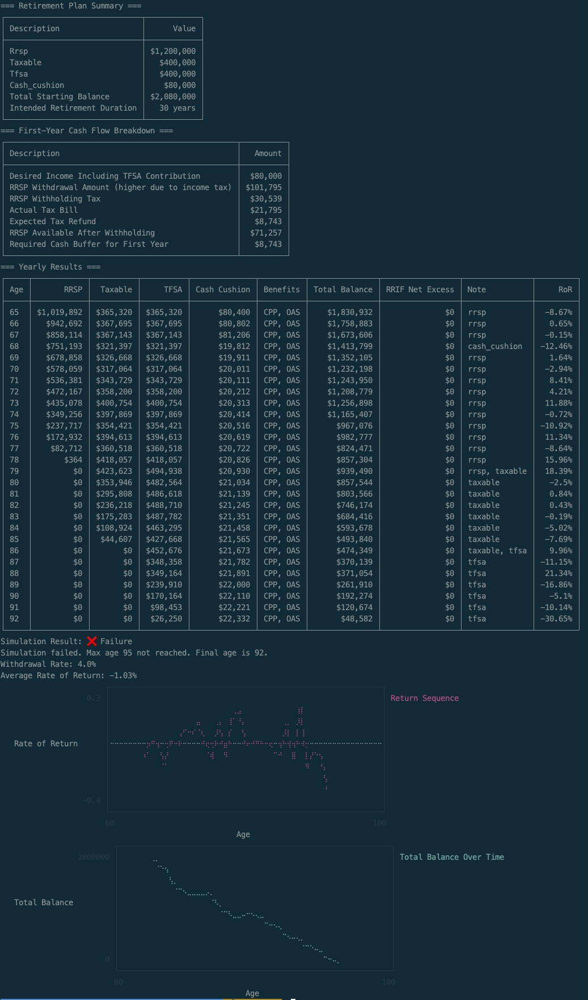

<!-- START doctoc generated TOC please keep comment here to allow auto update -->
<!-- DON'T EDIT THIS SECTION, INSTEAD RE-RUN doctoc TO UPDATE -->
**Table of Contents**  *generated with [DocToc](https://github.com/thlorenz/doctoc)*

- [Retirement Drawdown Simulator 🇨🇦](#retirement-drawdown-simulator-)
  - [Why I Built This](#why-i-built-this)
  - [What Makes This More Than a Calculator](#what-makes-this-more-than-a-calculator)
  - [Getting Started](#getting-started)
    - [Prerequisites](#prerequisites)
    - [Installation](#installation)
    - [Setup](#setup)
  - [Running the Simulation](#running-the-simulation)
  - [Sample Output](#sample-output)
  - [Determining Your Success Rate](#determining-your-success-rate)
  - [Documentation](#documentation)
  - [Insights](#insights)
  - [Disclaimer](#disclaimer)

<!-- END doctoc generated TOC please keep comment here to allow auto update -->

# Retirement Drawdown Simulator 🇨🇦

*A Canadian retirement stress-tester.*

**Retirement Drawdown Simulator** is a Canadian-specific Monte Carlo retirement simulator. It models realistic market volatility, applies federal and provincial income tax to RRSP withdrawals, handles CPP as taxable income, enforces RRIF mandatory withdrawal rules starting at age 71, and runs your scenario hundreds or thousands of times to show a *distribution* of outcomes — not just one optimistic number.

Professional retirement planning software costs thousands of dollars to have a CFP run a single plan for you, and you can't buy it yourself. This is a free, transparent, open-source tool for those who want to better understand how long their savings might realistically last under a straightforward withdrawal strategy — not a replacement for professional advice, but a useful starting point.

> [!IMPORTANT]
> By design, results tend to be lower than historical calculators or a CFP projection. The simulator is calibrated to stress-test your plan against futures that could be worse than history, not to reproduce historical averages.

## Why I Built This

When I started looking for a basic tool to simulate a retirement drawdown in Canada, I couldn't find anything that accounted for Canadian taxes, RRIF rules, or realistic market volatility — just generic advice to hire a financial planner. While professional guidance is valuable, a free, transparent tool should exist for those who want to understand how long their savings might last before committing to a plan.

## What Makes This More Than a Calculator

- **Tax-aware RRSP withdrawals.** RRSP withdrawals are taxable income. If you want $40,000 to spend, you have to withdraw significantly more. This simulator does a reverse tax calculation to find the exact gross withdrawal needed. For example, $40,000 after-tax in Ontario requires withdrawing approximately $46,200.

- **CPP as taxable income, handled correctly.** CPP and RRSP withdrawals are both taxable income that interact in a non-linear way. The simulator uses binary search to find the exact RRSP withdrawal where combined after-tax income hits your target. Naively subtracting CPP from your spending needs will give you the wrong answer.

- **RRIF mandatory withdrawals.** Your RRSP must convert to a RRIF by age 71, after which the government requires you to withdraw a rising percentage each year. The simulator enforces these rules and deposits any forced excess (after tax) into the taxable account.

- **Market volatility.** Returns are modelled using Geometric Brownian Motion with a Student-t distribution — producing fat-tailed shocks that reflect how markets behave, including occasional severe crashes. Since the model does not simulate market recovery after crashes (i.e. "reversion to the mean"), it intentionally produces more conservative results than historical studies — the goal is stress-testing, not historical calibration.

- **Monte Carlo success rate.** Run your scenario hundreds of times with different random return sequences. See the percentage that succeed, and a full percentile distribution of final balances — from the worst 5% of cases to the best 95%.

- **Optional TFSA contributions during RRSP drawdown.** The simulator can model intentionally drawing down the RRSP faster — withdrawing extra to fund annual TFSA contributions — as a potential tax optimization strategy.

- **Cash cushion for sequence-of-returns risk.** Optionally keep a portion of savings in a liquid account. During severe downturns the simulator draws from the cushion instead of selling investments at a loss.

- **All provinces and territories except Quebec.** Federal and provincial tax brackets, rates, and basic personal amount exemptions for: ONT, NL, PE, NS, NB, MB, SK, AB, BC, YT, NT, NU. Quebec is not supported due to QPP and provincial tax differences.

## Getting Started

### Prerequisites

- Ruby version as per `.ruby-version`

### Installation

Clone the repository:

```sh
git clone https://github.com/danielabar/retirement_drawdown_simulator_canada.git
cd retirement_drawdown_simulator_canada
```

Or download and extract the [project zip file](https://github.com/danielabar/retirement_drawdown_simulator_canada/archive/refs/heads/main.zip).

Install dependencies:

```sh
bundle install
```

### Setup

Copy the template and edit with your financial details:

```sh
cp inputs.yml.template inputs.yml
```

See [docs/configuration.md](docs/configuration.md) for a full reference of every setting, including guidance on choosing realistic `min`/`max` return values for your investment type.

Before retiring, also read [First Year of RRSP Withdrawals](docs/first_year.md) — there is a cash flow nuance in the first year that requires you to have some extra cash on hand before you pull the trigger.

## Running the Simulation

**Detailed mode** — single run, year-by-year table:

```sh
ruby main.rb
```

**Success rate mode** — runs the simulation many times and reports percentile outcomes:

```sh
ruby main.rb success_rate
```

**Custom inputs file** — pass a path to any YAML file instead of the default `inputs.yml`. Useful for running pre-built demo scenarios without touching your personal inputs:

```sh
ruby main.rb success_rate demo/four_percent_rule.yml
```

Argument order doesn't matter — the mode and file path are detected independently. If no file is specified, `inputs.yml` is read from the project root. If no mode is specified on the command line, it falls back to the `mode` key in the inputs file, then defaults to `detailed`.

## Sample Output

A sample Canadian retiree scenario: $1,000,000 portfolio (RRSP $600K, Taxable $200K, TFSA $200K), $40,000/year desired spending (4% withdrawal rate), retiring at 65 in Ontario, running to age 95. CPP of $800/month starts at 65 — roughly the average for someone taking CPP at 65. Returns are modelled as a balanced 60/40 portfolio (4% real average, min -25%, max +35%). A $40,000 cash cushion is held in reserve for downturns.

```sh
ruby main.rb demo/canadian_retiree.yml
```



A few things to notice in this run:

- **The gross RRSP withdrawal is $46,200, not $40,000.** The first-year cash flow table shows why: RRSP withdrawals are taxable income, so the simulator works backwards from the $40,000 desired spending to find the gross amount needed after tax. The withholding tax is $13,860 upfront, but the actual tax bill is only $6,200 — so a $7,660 refund is expected. This is the cash flow nuance explained in [First Year of RRSP Withdrawals](docs/first_year.md).
- **CPP is active from day one, but the gross RRSP withdrawal still reflects the combined tax on both.** CPP and RRSP withdrawals are both taxable income and interact non-linearly. The simulator uses binary search to find the RRSP amount that, combined with CPP, nets exactly $40,000 after tax.
- **The RRSP is exhausted around age 79**, after about 14 years of drawdown. From that point withdrawals shift to the taxable account, visible in the Note column switching from `rrsp` to `taxable`.
- **The TFSA compounds untouched from $200K to a peak of ~$835K** while the RRSP and taxable accounts are drawn down first. This is the tax-free compounding benefit of preserving the TFSA as long as possible.
- **The cash cushion was never triggered in this run.** The worst year (-22.47% at age 71) did not draw from the cushion because age 71 is when RRIF mandatory withdrawals begin — mandatory RRSP withdrawals take precedence over the cash cushion strategy.
- **RRIF Net Excess is $0 throughout.** By the time the RRSP converts to a RRIF at age 71, the balance has already been drawn down to ~$360K. The mandatory RRIF minimum at age 71 is 5.28% of the balance — roughly $19,000 — which is well below the ~$46,000 gross withdrawal needed to net $40,000. So the mandatory minimum never forces out more than is already being withdrawn, and there is no excess to deposit into the taxable account.
- **The Note column shows which account is being withdrawn from each year.** For most of retirement it reads `rrsp`, but at age 79 it switches to `rrsp, taxable` — meaning there wasn't enough left in the RRSP to cover the full year's spending, so the simulator combined the remaining RRSP balance with a top-up from the taxable account. From age 80 onward it's `taxable` only.
- **At age 95 the taxable account is nearly exhausted** (down to $6,383 the year before), so the Note switches to `taxable, tfsa` as the simulator draws the last of the taxable balance and takes the remainder from the TFSA — which has been compounding untouched for years and still holds $747,210 at the end.
- **This particular run ends with $793,898** — a successful outcome. A different random return sequence would produce a different result, which is why success rate mode runs the simulation thousands of times.

Here is a different run of the exact same scenario — same inputs, different random return sequence — that fails three years short of the target:



- **The average return was actually 4.46%** — slightly above the 4% target average. This plan didn't fail because of poor average returns. It failed because of the *sequence* of those returns.
- **Five negative years between ages 69 and 75**, several severe: -11.76%, -12.65%, -27.79%, -15.51%. This cluster of bad years in the critical early retirement window is exactly what sequence-of-returns risk looks like. Selling investments at depressed prices to fund spending leaves less capital to recover when returns improve.
- **The cash cushion was triggered at age 69** (-11.76%, below the -10% threshold), drawing it down from ~$41K to ~$10K in one year. After that it was too depleted to cover a full year's spending, so it couldn't be used again in the subsequent bad years at 71, 73, and 75.
- **The TFSA never had a chance to compound.** In the success run above, the TFSA grew from $200K to a peak of ~$835K because it was left untouched for decades. Here, the taxable account runs dry by age 84 — over a decade earlier — forcing the simulator into the TFSA much sooner. With the TFSA being drawn from age 84 onward instead of accumulating, it runs to zero at age 92.
- **Money runs out at age 92**, three years short of the target age of 95.

> [!NOTE]
> In practice, a real retiree watching their savings shrink would likely adapt — reducing discretionary spending, downsizing, or considering a life annuity to convert some savings into guaranteed income. Canadians also have a safety net the simulator doesn't currently model: **Old Age Security (OAS)**, available to most Canadians at 65, and the **Guaranteed Income Supplement (GIS)**, which provides additional support to low-income seniors. A retiree in financial difficulty would likely qualify for GIS before their savings hit zero. These programs are on the [roadmap](docs/roadmap.md). In the meantime, treat a simulated failure as a signal to pressure-test your plan — not a prediction that you will literally run out of money with no recourse.

## Determining Your Success Rate

Run the simulation in `success_rate` mode to see how your plan holds up across many different random return sequences. Using the same Canadian retiree scenario from above:

```bash
ruby main.rb success_rate demo/canadian_retiree.yml
```

| | |
|---|---|
| **Withdrawal Rate** | 4.0% |
| **Success Rate** | 89.2% |
| **Average Final Balance** | $1,314,143 |

| Percentile | Final Balance |
|---|---|
| 5th | $26,616 |
| 10th | $40,295 |
| 25th | $324,435 |
| 50th (Median) | $829,747 |
| 75th | $1,723,511 |
| 90th | $3,018,513 |
| 95th | $4,190,952 |

The output shows:
- **Success rate** — what percentage of simulated retirements reached `max_age` with at least `success_factor × desired_spending` remaining
- **Average final balance** — the mean balance across all runs
- **Final balance percentiles** — the distribution from the worst 5% of outcomes to the best 95%

For this scenario, **89.2% of simulated retirements succeeded** — meaning roughly 1 in 9 runs out of money before age 95. The $800/month CPP benefit does significant work here: the same 4% scenario without CPP produces a success rate around 71% (see [Is the 4% Rule Actually Safe?](docs/insights/four_percent_rule.md)). Guaranteed income that doesn't depend on market performance directly reduces sequence-of-returns risk, which is the main threat to a retirement portfolio.

The percentile spread tells the rest of the story. The median survivor ends with ~$830K — roughly 20x annual spending, still comfortably funded. But the 5th and 10th percentiles ($27K and $40K) are essentially empty, meaning the roughly 1-in-10 scenarios that go badly go very badly. The upper tail is wide too: the top quartile ends with over $1.7M, and the best 5% exceed $4M, driven by compounding in the TFSA over decades of untouched growth.

You control what "success" means via the `success_factor` setting in `inputs.yml`. A `success_factor` of `1` means ending with at least one year's spending left; `1.5` means one and a half years' worth, and so on. For example, with `max_age: 95`, `desired_spending: 40000`, and `success_factor: 1.5`, success means having at least $60,000 left at age 95. See [Configuration](docs/configuration.md) for details.

The percentile table is as informative as the success rate. The spread between the 5th and 95th percentile shows how wide the range of outcomes is, and the low percentiles show what your situation might look like in the scenarios where things go badly — which is precisely the information you need to pressure-test a plan.

> [!NOTE]
> The 4% rule is often cited as having a "95% success rate" — but that figure comes from US historical data replayed over past sequences. This simulator uses Geometric Brownian Motion without mean reversion, intentionally modelling futures that could be worse than history. For the same 4% scenario, this simulator produces a success rate closer to **70%**. See [How It Works](docs/how-it-works.md#geometric_brownian_motion-recommended) for why, and [Is the 4% Rule Actually Safe?](docs/insights/four_percent_rule.md) for a detailed analysis of what this means in practice.

## Documentation

- [Configuration Reference](docs/configuration.md) — all `inputs.yml` settings explained
- [How It Works](docs/how-it-works.md) — withdrawal order, tax engine, CPP interaction, RRIF rules, GBM, cash cushion, and limitations
- [Architecture](docs/architecture.md) — code structure, modules, classes, and how they connect (for contributors and developers)
- [First Year of RRSP Withdrawals](docs/first_year.md) — the withholding tax cash flow nuance to know before retiring
- [Roadmap](docs/roadmap.md) — planned features and known limitations

## Insights

Deep dives from running thousands of retirement simulations. These explore how different decisions and strategies affect long-term financial security.

- [When to Take CPP](docs/insights/when_to_take_cpp.md) — how delaying CPP from age 60 to 65 to 70 affects success rates and worst-case outcomes
- [Is the 4% Rule Actually Safe?](docs/insights/four_percent_rule.md) — where the "95% safe" figure comes from and why the real answer is more nuanced
- [TFSA Contributions During Drawdown](docs/insights/tfsa_contributions_during_drawdown.md) — does shifting money into the TFSA during RRSP drawdown improve outcomes?
- [Cash Cushion vs. Keeping It Invested](docs/insights/cash_cushion_vs_invested.md) — is the sequence-of-returns protection worth the opportunity cost?

## Disclaimer

This tool is for **informational and educational purposes only**. It does **not** constitute financial, tax, or investment advice. The calculations are based on **simplified assumptions** and **may not reflect your actual financial situation**. Consult a **qualified financial professional** before making any retirement, investment, or other financial decisions. Use at your own risk.
