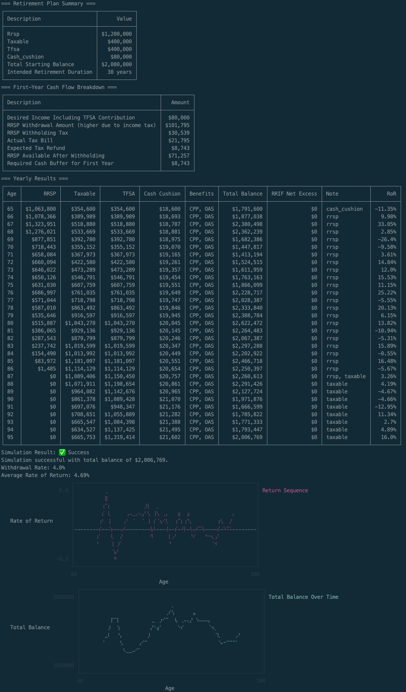
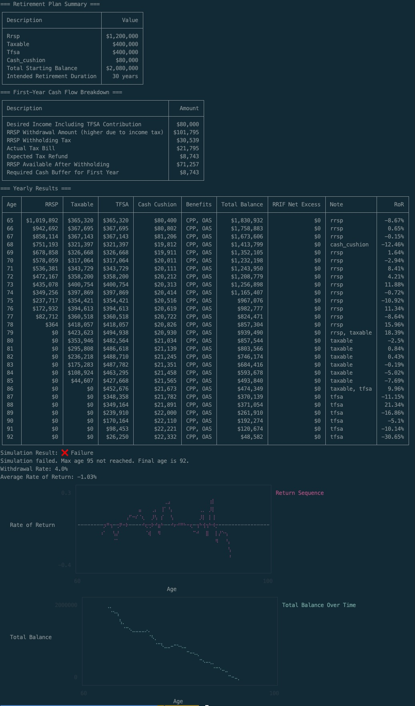

<!-- START doctoc generated TOC please keep comment here to allow auto update -->
<!-- DON'T EDIT THIS SECTION, INSTEAD RE-RUN doctoc TO UPDATE -->
**Table of Contents**  *generated with [DocToc](https://github.com/thlorenz/doctoc)*

- [Retirement Drawdown Simulator 🇨🇦](#retirement-drawdown-simulator-)
  - [Why I Built This](#why-i-built-this)
  - [What Makes This More Than a Calculator](#what-makes-this-more-than-a-calculator)
  - [Getting Started](#getting-started)
    - [Prerequisites](#prerequisites)
    - [Installation](#installation)
    - [Setup](#setup)
  - [Running the Simulation](#running-the-simulation)
  - [Sample Output](#sample-output)
  - [Determining Your Success Rate](#determining-your-success-rate)
  - [Documentation](#documentation)
  - [Insights](#insights)
  - [Disclaimer](#disclaimer)

<!-- END doctoc generated TOC please keep comment here to allow auto update -->

# Retirement Drawdown Simulator 🇨🇦

*A Canadian retirement stress-tester.*

**Retirement Drawdown Simulator** is a Canadian-specific Monte Carlo retirement simulator. It models realistic market volatility, applies federal and provincial income tax to RRSP withdrawals, handles CPP and OAS as taxable income, enforces RRIF mandatory withdrawal rules starting at age 71, and runs your scenario hundreds or thousands of times to show a *distribution* of outcomes — not just one optimistic number.

Professional retirement planning software costs thousands of dollars to have a CFP run a single plan for you, and you can't buy it yourself. This is a free, transparent, open-source tool for those who want to better understand how long their savings might realistically last under a straightforward withdrawal strategy — not a replacement for professional advice, but a useful starting point.

> [!IMPORTANT]
> By design, results tend to be lower than historical calculators or a CFP projection. The simulator is calibrated to stress-test your plan against futures that could be worse than history, not to reproduce historical averages.

## Why I Built This

When I started looking for a basic tool to simulate a retirement drawdown in Canada, I couldn't find anything that accounted for Canadian taxes, RRIF rules, or realistic market volatility — just generic advice to hire a financial planner. While professional guidance is valuable, a free, transparent tool should exist for those who want to understand how long their savings might last before committing to a plan.

## What Makes This More Than a Calculator

- **Tax-aware RRSP withdrawals.** RRSP withdrawals are taxable income. If you want $40,000 to spend, you have to withdraw significantly more. This simulator does a reverse tax calculation to find the exact gross withdrawal needed. For example, $40,000 after-tax in Ontario requires withdrawing approximately $46,200.

- **CPP and OAS as taxable income, handled correctly.** CPP, OAS, and RRSP withdrawals are all taxable income that interact in a non-linear way. The simulator uses binary search to find the exact RRSP withdrawal where combined after-tax income hits your target. Naively subtracting CPP or OAS from your spending needs will give you the wrong answer. OAS increases 10% at age 75 and can be deferred from 65 to 70 for a bonus of up to +36%.

- **RRIF mandatory withdrawals.** Your RRSP must convert to a RRIF by age 71, after which the government requires you to withdraw a rising percentage each year. The simulator enforces these rules and deposits any forced excess (after tax) into the taxable account.

- **Market volatility.** Returns are modelled using Geometric Brownian Motion with a Student-t distribution — producing fat-tailed shocks that reflect how markets behave, including occasional severe crashes. Since the model does not simulate market recovery after crashes (i.e. "reversion to the mean"), it intentionally produces more conservative results than historical studies — the goal is stress-testing, not historical calibration.

- **Monte Carlo success rate.** Run your scenario hundreds of times with different random return sequences. See the percentage that succeed, and a full percentile distribution of final balances — from the worst 5% of cases to the best 95%.

- **Optional TFSA contributions during RRSP drawdown.** The simulator can model intentionally drawing down the RRSP faster — withdrawing extra to fund annual TFSA contributions — as a potential tax optimization strategy.

- **Cash cushion for sequence-of-returns risk.** Optionally keep a portion of savings in a liquid account. During severe downturns the simulator draws from the cushion instead of selling investments at a loss.

- **All provinces and territories except Quebec.** Federal and provincial tax brackets, rates, and basic personal amount exemptions for: ONT, NL, PE, NS, NB, MB, SK, AB, BC, YT, NT, NU. Quebec is not supported due to QPP and provincial tax differences.

## Getting Started

### Prerequisites

- Ruby version as per `.ruby-version`

### Installation

Clone the repository:

```sh
git clone https://github.com/danielabar/retirement_drawdown_simulator_canada.git
cd retirement_drawdown_simulator_canada
```

Or download and extract the [project zip file](https://github.com/danielabar/retirement_drawdown_simulator_canada/archive/refs/heads/main.zip).

Install dependencies:

```sh
bundle install
```

### Setup

Copy the template and edit with your financial details:

```sh
cp inputs.yml.template inputs.yml
```

See [docs/configuration.md](docs/configuration.md) for a full reference of every setting, including guidance on choosing realistic `min`/`max` return values for your investment type.

Before retiring, also read [First Year of RRSP Withdrawals](docs/first_year.md) — there is a cash flow nuance in the first year that requires you to have some extra cash on hand before you pull the trigger.

## Running the Simulation

**Detailed mode** — single run, year-by-year table:

```sh
ruby main.rb
```

**Success rate mode** — runs the simulation many times and reports percentile outcomes:

```sh
ruby main.rb success_rate
```

**Custom inputs file** — pass a path to any YAML file instead of the default `inputs.yml`. Useful for running pre-built demo scenarios without touching your personal inputs:

```sh
ruby main.rb success_rate demo/four_percent_rule.yml
```

Argument order doesn't matter — the mode and file path are detected independently. If no file is specified, `inputs.yml` is read from the project root. If no mode is specified on the command line, it falls back to the `mode` key in the inputs file, then defaults to `detailed`.

## Sample Output

A sample Canadian retiree scenario: $2,000,000 portfolio (RRSP $1.2M, Taxable $400K, TFSA $400K), $80,000/year desired spending (4% withdrawal rate), retiring at 65 in Ontario, running to age 95. CPP of $800/month starts at 65 — roughly the average for someone taking CPP at 65 — along with full OAS at 65 (40 years of Canadian residency). Returns are modelled as a balanced 60/40 portfolio (4% real average, min -25%, max +35%). An $80,000 cash cushion is held in reserve for downturns.

```sh
ruby main.rb demo/readme_canadian_retiree.yml
```



A few things to notice in this run:

- **The first-year cash flow table shows the withholding mechanics for an $80K spending plan.** The simulator works backwards from $80,000 desired spending to find the gross RRSP withdrawal needed after tax. At this income level in Ontario, the withholding tax is $30,539 upfront and the actual tax bill is $21,795 — so an $8,743 refund is expected. This is the cash flow nuance explained in [First Year of RRSP Withdrawals](docs/first_year.md).
- **CPP and OAS are both active from day one**, visible in the Benefits column throughout. All three income sources — RRSP withdrawals, CPP, and OAS — are taxable and interact non-linearly. The simulator uses binary search to find the RRSP withdrawal that, combined with CPP and OAS, nets exactly $80,000 after tax. Together CPP (~$9,600/year) and OAS (~$8,500/year) cover roughly $18,000 of annual spending — about 22% of the spending target — reducing but not eliminating the annual draw on the portfolio.
- **The cash cushion was triggered in the very first year** (age 65, -11.35%, well below the -10% threshold). Rather than selling RRSP shares at a loss, the simulator drew from the cushion to fund the portfolio-funded portion of spending, reducing it from $80,000 to ~$18,600. It partially replenished via the 0.5% annual savings rate and remained around $18–20K for the rest of retirement.
- **The RRSP lasts until age 87** — 22 years of drawdown. The Note column shows `rrsp` from age 66 through 86, switching to `rrsp, taxable` at age 87 when the final RRSP balance is combined with a taxable top-up, then `taxable` from age 88 onward.
- **RRIF mandatory withdrawals begin at age 71.** The mandatory minimum is always below the gross withdrawal already being taken — no excess is produced and RRIF Net Excess is $0 throughout.
- **The TFSA and taxable accounts grow in parallel** while the RRSP is drawn down. The TFSA is never touched, growing from $400K to $1,319,414 by age 95. The taxable account reaches $665,753. The RRSP funds the full retirement through age 87 before the taxable account takes over for the final years.
- **This particular run ends with $2,006,769** — a successful outcome, finishing above the $2,080,000 starting balance despite 30 years of withdrawals. A different random return sequence would produce a different result, which is why success rate mode runs the simulation thousands of times.

Here is a different run of the exact same scenario — same inputs, different random return sequence — that fails three years short of the target:



- **The average return was -1.03%** — not just below the 4% target but negative on average. This plan didn't fail because spending was reckless. It failed because of an extraordinarily bad sequence of returns.
- **The early years were the problem**: -8.67% at age 65, near-flat at 66 and 67, then -12.46% at age 68. Four consecutive weak or negative years at the start of retirement is exactly the sequence-of-returns risk scenario — selling depreciated assets to fund spending leaves less capital to recover when markets eventually improve.
- **The cash cushion was triggered at age 68** (-12.46%, below the -10% threshold), drawing it down from ~$80,000 to ~$19,800. Too depleted afterward to absorb the continued string of poor years that followed.
- **The RRSP was exhausted at age 79** — only 14 years of drawdown vs 22 in the success run. Repeated selling at depressed prices compounded into a much faster depletion. Withdrawals shifted to the taxable account, which itself ran dry by age 86.
- **The TFSA never had a chance to compound.** In the success run above, the TFSA was left untouched for all 30 years, growing to $1.3M. Here, the simulator was forced into the TFSA by age 87 with only ~$452K left — less than a third of the success-run TFSA — and it ran to zero at age 92.
- **Money runs out at age 92**, three years short of the target age of 95.

> [!NOTE]
> In practice, a real retiree watching their savings shrink would likely adapt — reducing discretionary spending, downsizing, or considering a life annuity to convert some savings into guaranteed income. Canadians also have a safety net worth noting: **Old Age Security (OAS)**, available to most Canadians at 65, is now modelled by this simulator — it is treated as taxable income and reduces required RRSP withdrawals accordingly. The **Guaranteed Income Supplement (GIS)**, which provides additional support to low-income seniors, is not yet modelled. A retiree in financial difficulty would likely qualify for GIS before their savings hit zero. In the meantime, treat a simulated failure as a signal to pressure-test your plan — not a prediction that you will literally run out of money with no recourse.

## Determining Your Success Rate

Run the simulation in `success_rate` mode to see how your plan holds up across many different random return sequences. Using the same Canadian retiree scenario from above:

```bash
ruby main.rb success_rate demo/readme_canadian_retiree.yml
```

| | |
|---|---|
| **Withdrawal Rate** | 4.0% |
| **Success Rate** | 85.5% |
| **Average Final Balance** | $2,369,294 |

| Percentile | Final Balance |
|---|---|
| 5th | $42,973 |
| 10th | $66,260 |
| 25th | $485,400 |
| 50th (Median) | $1,449,133 |
| 75th | $3,167,311 |
| 90th | $5,331,443 |
| 95th | $8,311,033 |

The output shows:
- **Success rate** — what percentage of simulated retirements reached `max_age` with at least `success_factor × desired_spending` remaining
- **Average final balance** — the mean balance across all runs
- **Final balance percentiles** — the distribution from the worst 5% of outcomes to the best 95%

For this scenario, **85.5% of simulated retirements succeeded** — meaning roughly 1 in 7 runs out of money before age 95. The CPP and OAS benefits (~$18,000/year combined) reduce the annual portfolio draw, but at $80,000/year spending the portfolio still carries most of the load. Guaranteed income that doesn't depend on market performance directly reduces sequence-of-returns risk, which is the main threat to a retirement portfolio.

The percentile spread tells the rest of the story. The median survivor ends with ~$1.45M — roughly 18x annual spending, still comfortably funded. But the 5th and 10th percentiles ($43K and $66K) are essentially empty: the failure scenario above isn't a fluke, it's what roughly 1-in-7 runs looks like. The upper tail is very wide: the top quartile ends with over $3.1M, and the best 5% exceed $8.3M, driven by decades of untouched TFSA compounding in runs where returns cooperated.

You control what "success" means via the `success_factor` setting in `inputs.yml`. A `success_factor` of `1` means ending with at least one year's spending left; `1.5` means one and a half years' worth, and so on. For example, with `max_age: 95`, `desired_spending: 80000`, and `success_factor: 1.5`, success means having at least $120,000 left at age 95. See [Configuration](docs/configuration.md) for details.

> [!NOTE]
> The 4% rule is often cited as having a "95% success rate" — but that figure comes from US historical data replayed over past sequences. This simulator uses Geometric Brownian Motion without mean reversion, intentionally modelling futures that could be worse than history. For the same 4% scenario, this simulator produces lower success rates. See [How It Works](docs/how-it-works.md#geometric_brownian_motion-recommended) for why, and [Is the 4% Rule Actually Safe?](docs/insights/four_percent_rule.md) for a detailed analysis of what this means in practice.

## Documentation

- [Configuration Reference](docs/configuration.md) — all `inputs.yml` settings explained
- [How It Works](docs/how-it-works.md) — withdrawal order, tax engine, CPP interaction, RRIF rules, GBM, cash cushion, and limitations
- [Architecture](docs/architecture.md) — code structure, modules, classes, and how they connect (for contributors and developers)
- [First Year of RRSP Withdrawals](docs/first_year.md) — the withholding tax cash flow nuance to know before retiring
- [Roadmap](docs/roadmap.md) — planned features and known limitations

## Insights

Deep dives from running thousands of retirement simulations. These explore how different decisions and strategies affect long-term financial security.

- [When to Take CPP](docs/insights/when_to_take_cpp.md) — how delaying CPP from age 60 to 65 to 70 affects success rates and worst-case outcomes
- [Is the 4% Rule Actually Safe?](docs/insights/four_percent_rule.md) — where the "95% safe" figure comes from and why the real answer is more nuanced
- [TFSA Contributions During Drawdown](docs/insights/tfsa_contributions_during_drawdown.md) — does shifting money into the TFSA during RRSP drawdown improve outcomes?
- [Cash Cushion vs. Keeping It Invested](docs/insights/cash_cushion_vs_invested.md) — is the sequence-of-returns protection worth the opportunity cost?

## Disclaimer

This tool is for **informational and educational purposes only**. It does **not** constitute financial, tax, or investment advice. The calculations are based on **simplified assumptions** and **may not reflect your actual financial situation**. Consult a **qualified financial professional** before making any retirement, investment, or other financial decisions. Use at your own risk.
