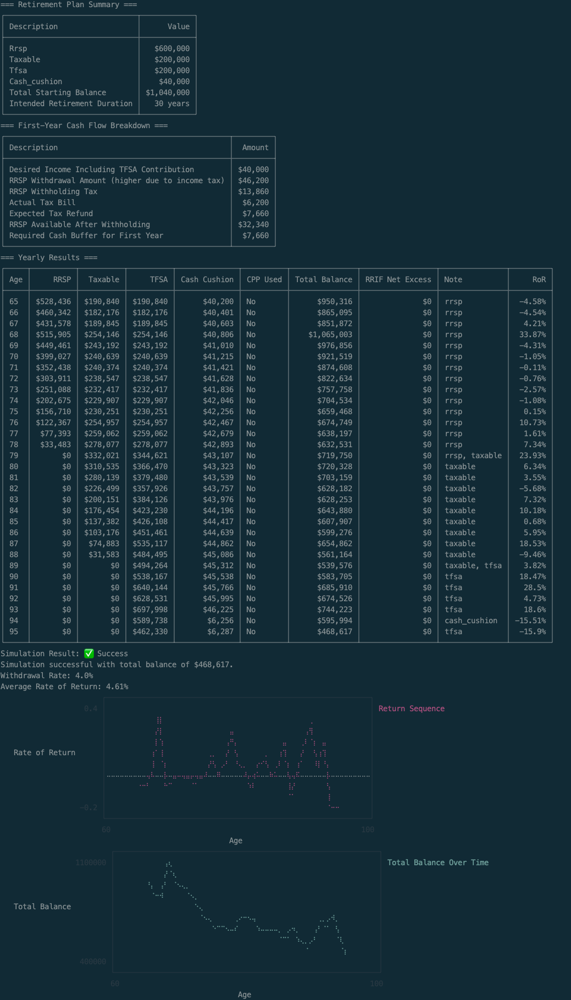
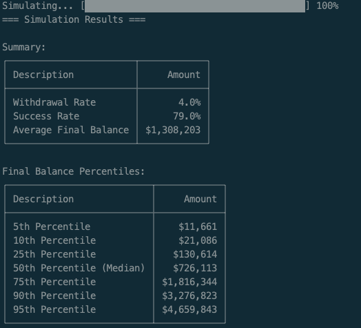

# Retirement Drawdown Simulator 🇨🇦

This is a simple retirement drawdown calculator for Canadians. It models the following drawdown strategy:

1. Withdraw from RRSP first (enough for spending + optional TFSA contribution).
2. Withdraw from Taxable account next (enough for spending + optional TFSA contribution).
3. Withdraw from TFSA last.
4. Optionally if you specify a cash cushion (i.e. amount of savings you have in an easily accessible liquid account like a high interest savings account), then the simulation will drawdown from the cash cushion rather than investment accounts during periods of market downturns.
5. Optionally you can specify at what age you plan to take CPP and your monthly entitlement amount. In this case the simulator will reduce your withdrawals accordingly, including factoring in that both RRSP withdrawals and CPP count as taxable income.

> [!IMPORTANT]
> RRSP withdrawals are treated as income and subject to federal and provincial income tax. This project does a reverse tax calculation, to determine what amount you actually need to withdraw from RRSP to achieve desired spending (and optional TFSA contribution) amount. This is often overlooked in FIRE/retirement calculators.

The idea being to drain the RRSP as quickly as possible to avoid mandatory RRIF withdrawals at age 71, with potential large tax liability. Although there's a trade-off in needing to withdraw more earlier for additional TFSA contributions can increase your tax bracket. This application let's you try out different scenarios to see what works best for you.

It also models your first year of RRSP withdrawal and why you may need an additional cash buffer to cover some shortfall. See [First Year Shortfall](docs/first_year.md) for further details.

You can also run the same scenario over and over with different options for randomized returns, to see what your chances of success are.

## Why I Built This

When I started looking for a basic tool to simulate a retirement drawdown in Canada, I couldn’t find anything — just advice to hire a financial planner. While professional guidance is valuable, a relatively simple, transparent tool should exist for those who want to see how long their savings might last under a given withdrawal strategy.

Specifically, this tool could be useful for someone who has three accounts from which they wish to drawdown in retirement: an RRSP, taxable account, and TFSA. There are many assumptions and some things such as RRIF withdrawals and capital gains are not handled, although planned. See the [roadmap](docs/roadmap.md) for more details.

### Disclaimer ⚠️

This tool is for **informational and educational purposes only**. It does **not** constitute financial, tax, or investment advice. The calculations are based on **simplified assumptions** and **may not reflect your actual financial situation**. You should consult with a **qualified financial professional** before making any retirement, investment, or other financial decisions. Use this tool at your own risk.

## Getting Started

### Prerequisites

- Ruby version installed as per `.ruby-version`

### Installation

1. Clone the repository:

   ```sh
   git clone https://github.com/danielabar/retirement-simulator.git
   cd retirement-simulator
   ```

2. Install dependencies:

   ```sh
   bundle install
   ```

### Setup

1. Copy the template file:

   ```sh
   cp inputs.yml.template inputs.yml
   ```

2. Edit `inputs.yml` and enter your actual financial details.

   - The template file (`inputs.yml.template`) contains example values.
   - Open `inputs.yml` in a text editor and replace the values with your actual financial information.

### Running the Simulation

Run the script with:

```sh
ruby main.rb
```

The output will display a table showing account balances each year until depletion, and whether your plan was successful or failed.

Or to run the simulation multiple times to see what percentage of scenarios are successful, run:

```sh
ruby main.rb success_rate
```

## Configuration

Your financial inputs are stored in `inputs.yml`. Below is an example:

```yaml
# Mode can be 'detailed' for a single run with detailed output, or 'success_rate'
mode: detailed

# For success_rate mode
total_runs: 1000

# Age at which you plan to start retirement
retirement_age: 65

# Maximum age to run the simulation until.
# This prevents infinite loops if investment growth outpaces withdrawals.
# Choose a reasonable upper bound based on longevity estimates,
# but note that this is just for the simulation and not a personal prediction.
max_age: 95

# Province or territory where you reside
# Valid values are: ONT, NL, PE, NS, NB, MB, SK, AB, BC, YT, NT, NU
province_code: ONT

# Success factor: defines the multiplier for total_balance needed by max_age for success.
# Supports fractional, eg: 1.5
success_factor: 1

# Growth rate average, min, and max to generate variability
# Enter the "real" return rather than nominal as inflation isn't handled currently.
# For example if you're invested in broad market index funds or ETF's and using
# an average return of 8%, but inflation is around 3%, then put 5% real return here.
# The min and max are to constrain volatility. For example the market has dropped
# by 30% and has grown by that much as well.
# Set a downturn_threshold so if market return is below this amount, use cash_cushion.
annual_growth_rate:
  average: 0.05
  min: -0.3
  max: 0.3
  downturn_threshold: -0.2

# Choose the return sequence generator: mean, geometric_brownian_motion, constant
# If using `success_rate` mode, then choose either `mean` or `geometric_brownian_motion`
# `constant` returns are conceptually easy to understand, and produce pleasing predictable results,
# but are unrealistic as the market doesn't actually do this.
return_sequence_type: geometric_brownian_motion

# Optionally continue to make TFSA contributions during RRSP and Taxable drawdown phases
# If you don't want to make any TFSA contributions during drawdown, set this to 0.
annual_tfsa_contribution: 0

# After tax amount you need per year in retirement (NOT including TFSA contribution, this is your spending number).
# To get an accurate number here, you should track your spending for at least a year
# Or review a year's worth of past credit card statements and other sources of spending.
# Add up:
#   1. Variable spending (groceries, personal, entertainment, travel, etc.)
#   2. Fixed spending (any constant recurring payments)
#   3. Lumpy (eg: new car, replace roof, replace appliances etc. only happen every few years so divide amount by how many years expense occurs)
desired_spending: 40000

# Starting account balances.
# The cash_cushion will be used in case of market downturns (value you set earlier in downturn_threshold).
# Set cash_cushion balance to 0 if you don't want to use it or don't have a cash cushion.
accounts:
  rrsp: 600000
  taxable: 200000
  tfsa: 200000
  cash_cushion: 40000

# Enter the age at which you plan to start CPP and the monthly amount you're entitled to.
# You can find this value by logging in to your My Service Canada account.
# The values shown in My Service Canada assume you continue to work at your current income
# up until the age you start taking CPP.
# If you're planning on retiring earlier than this, then your actual CPP numbers will be
# lower due to those additional years of no contributions.
# In this case, use https://research-tools.pwlcapital.com/research/cpp to estimate what you may actually get.
# To run the simulation without CPP, set the monthly_amount to 0.
cpp:
  start_age: 65
  monthly_amount: 0

# Taxes
# Withholding tax may be greater than your actual tax bill, you'll get a refund when you file your taxes.
# In the first year of retirement, you'll have to have some extra cash available to "float" the difference.
# In subsequent years, the previous year's tax refund will be used to fund part of next years spending.
# RRSP Withholding tax: https://www.canada.ca/en/revenue-agency/services/tax/individuals/topics/rrsps-related-plans/making-withdrawals/tax-rates-on-withdrawals.html
# Assumption is you'll be withdrawing at least 15K which lands in 30% withholding tax.
taxes:
  rrsp_withholding_rate: 0.3
```

## Sample Output

Here's a run using `inputs.yml` copied from `inputs.yml.template` with a successful result - i.e. money lasts up from a starting retirement age of 65 until `max_age` of 95, with at least 1x desired_income left. The desired_income of `$40,000` is 4% of the total starting balance of `$1,000,000` (which is divided among RRSP, taxable, and TFSA accounts). i.e. this is the 4% rule over a thirty year retirement period.

```
ruby main.rb
```



Here's another run where a bad initial sequence of returns causes the money to run out by age 89:

```
ruby main.rb
```


### Determining Your Success Rate

You can use the `success_rate` mode (either specify it in `inputs.yml` or override it at the command line as shown below) to run the simulation many times over. In this case, it calculates the percentage of successful scenarios. For example, this shows that the 4% withdrawal rate over a thirty year period has about a `77%` success rate, rather than the `95%` rate that's often reported in personal finance articles (which is actually based on US historical data):

```
ruby main.rb success_rate
```



Success is defined as making it to `max_age` with at least `success_factor` * annual withdrawals in that phase, money left.

For example, suppose `max_age` is `105`, `desired_spending` is `40000` and success_factor is `1.5`. Then if the scenario shows that there's still 40000 * 1.5 = `$60,000` left by age `105`, this is considered a success.

> [!NOTE]
> The 4% rule research considers reaching the end of life with even just `$1.00` a "success". Realistically, most people would be freaking out if they were getting on in their 90's and their account balance was dwindling down like that.

### ⚠️ Important: Keep `inputs.yml` Private

Since `inputs.yml` contains personal financial information, it is **ignored by Git** (see `.gitignore`).
**Do not commit it** to avoid exposing sensitive data.
