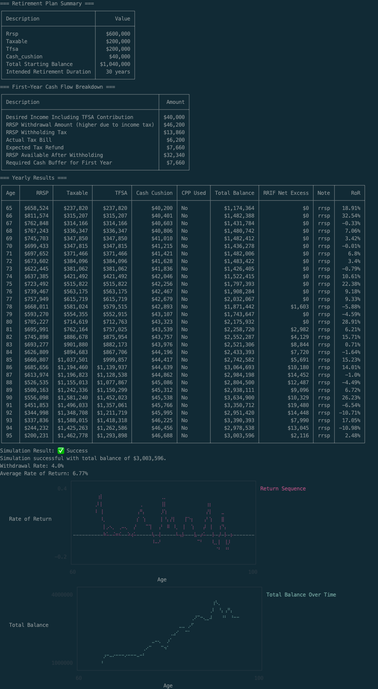

<!-- START doctoc generated TOC please keep comment here to allow auto update -->
<!-- DON'T EDIT THIS SECTION, INSTEAD RE-RUN doctoc TO UPDATE -->
**Table of Contents**  *generated with [DocToc](https://github.com/thlorenz/doctoc)*

- [Retirement Drawdown Simulator 🇨🇦](#retirement-drawdown-simulator-)
  - [Why I Built This](#why-i-built-this)
  - [Disclaimer](#disclaimer)
  - [Getting Started](#getting-started)
    - [Prerequisites](#prerequisites)
    - [Installation](#installation)
    - [Setup](#setup)
    - [Configuration](#configuration)
    - [Running the Simulation](#running-the-simulation)
  - [Output](#output)
    - [Interpreting Yearly Output](#interpreting-yearly-output)
    - [CPP](#cpp)
    - [Mandatory RRIF Withdrawals](#mandatory-rrif-withdrawals)
    - [Rate of Return](#rate-of-return)
    - [Determining Your Success Rate](#determining-your-success-rate)
  - [Insights](#insights)

<!-- END doctoc generated TOC please keep comment here to allow auto update -->

# Retirement Drawdown Simulator 🇨🇦

A retirement drawdown calculator for Canadians. It simulates how long your savings might last in retirement, assuming you have three accounts (RRSP, taxable, and TFSA) holding some broadly diversified ETFs or index funds for which you can specify an average market return.

Features include:

1. Withdraw from RRSP first, accounting for federal and provincial income taxes.
2. Withdraw from Taxable account next.
3. Withdraw from TFSA last.
4. Withdrawals from multiple accounts are combined if there's not quite enough in one account, but there is in the next account.
5. Optionally you can choose to make a TFSA contribution during the years that the RRSP and taxable accounts are being drawn down, in an attempt to maximize tax free withdrawals later in life (and minimize mandatory RRIF withdrawals after age 71).
6. Optionally if you specify a cash cushion (i.e. amount of savings you have in an easily accessible liquid account like a high interest savings account), then the simulation will drawdown from the cash cushion rather than investment accounts during periods of market downturns.
7. Optionally you can specify at what age you plan to take CPP and your monthly entitlement amount. In this case the simulator will reduce your withdrawals accordingly, including factoring in that both RRSP withdrawals and CPP count as taxable income.
8. Mandatory RRIF withdrawals starting at age 71, according to these [rates](https://www.canada.ca/en/revenue-agency/services/tax/businesses/topics/completing-slips-summaries/t4rsp-t4rif-information-returns/payments/chart-prescribed-factors.html). If the mandatory withdrawal is greater than what you would have wanted to take out, then the after-tax amount is deposited into the taxable account.

> [!IMPORTANT]
> RRSP withdrawals are treated as income and subject to federal and provincial income tax. This project does a reverse tax calculation, to determine what amount you actually need to withdraw from RRSP to achieve desired spending (and optional TFSA contribution) amount. This is often overlooked in FIRE/retirement calculators. For example, if you want to spend `$40,000` from your RRSP in Ontario, as of 2025 tax rates, you'd have to withdraw approximately `$46,200`.

It also models your first year of RRSP withdrawal and why you may need an additional cash buffer to cover some shortfall. See [First Year Shortfall](docs/first_year.md) for further details.

You can also run the same scenario over and over with different options for randomized returns, to see what your chances of success are.

## Why I Built This

When I started looking for a basic tool to simulate a retirement drawdown in Canada, I couldn’t find anything — just advice to hire a financial planner. While professional guidance is valuable, a free, transparent tool should exist for those who want to see how long their savings might last under a relatively simple withdrawal strategy.

## Disclaimer

This tool is for **informational and educational purposes only**. It does **not** constitute financial, tax, or investment advice. The calculations are based on **simplified assumptions** and **may not reflect your actual financial situation**. You should consult with a **qualified financial professional** before making any retirement, investment, or other financial decisions. Use this tool at your own risk.

## Getting Started

### Prerequisites

- Ruby version installed as per `.ruby-version`

### Installation

1. Clone the repository:

   ```sh
   git clone https://github.com/danielabar/retirement-simulator.git
   cd retirement-simulator
   ```

Or download and extract the [project zip file](https://github.com/danielabar/retirement_drawdown_simulator_canada/archive/refs/heads/main.zip).

2. Install dependencies:

   ```sh
   bundle install
   ```

### Setup

1. Copy the template file:

   ```sh
   cp inputs.yml.template inputs.yml
   ```

2. Edit `inputs.yml` and enter your actual financial details.

   - The template file (`inputs.yml.template`) contains example values.
   - Open `inputs.yml` in a text editor and replace the values with your actual financial information.

### Configuration

Your financial inputs are stored in `inputs.yml`. Below is an example:

```yaml
# Mode can be 'detailed' for a single run with detailed output, or 'success_rate'
mode: detailed

# For success_rate mode
total_runs: 1000

# Age at which you plan to start retirement
retirement_age: 65

# Maximum age to run the simulation until.
# This prevents infinite loops if investment growth outpaces withdrawals.
# Choose a reasonable upper bound based on longevity estimates,
# but note that this is just for the simulation and not a personal prediction.
max_age: 95

# Province or territory where you reside
# Valid values are: ONT, NL, PE, NS, NB, MB, SK, AB, BC, YT, NT, NU
province_code: ONT

# Success factor: defines the multiplier for total_balance needed by max_age for success.
# Supports fractional, eg: 1.5
success_factor: 1

# Growth rate average, min, and max to generate variability
# Enter the "real" return rather than nominal as inflation isn't handled currently.
# For example if you're invested in broad market index funds or ETF's and using
# an average return of 8%, but inflation is around 3%, then put 5% real return here.
# The min and max are to constrain volatility. For example the market has dropped
# by 30% and has grown by that much as well.
# Set a downturn_threshold so if market return is below this amount, use cash_cushion.
# Set savings to the interest rate you're earning on your cash cushion.
annual_growth_rate:
  average: 0.05
  min: -0.3
  max: 0.3
  downturn_threshold: -0.1
  savings: 0.005

# Choose the return sequence generator: mean, geometric_brownian_motion, constant
# If using `success_rate` mode, then choose either `mean` or `geometric_brownian_motion`
# `constant` returns are conceptually easy to understand, and produce pleasing predictable results,
# but are unrealistic as the market doesn't actually do this.
return_sequence_type: geometric_brownian_motion

# Optionally continue to make TFSA contributions during RRSP and Taxable drawdown phases
# If you don't want to make any TFSA contributions during drawdown, set this to 0.
annual_tfsa_contribution: 0

# After tax amount you need per year in retirement (NOT including TFSA contribution, this is your spending number).
# To get an accurate number here, you should track your spending for at least a year
# Or review a year's worth of past credit card statements and other sources of spending.
# Add up:
#   1. Variable spending (groceries, personal, entertainment, travel, etc.)
#   2. Fixed spending (any constant recurring payments)
#   3. Lumpy (eg: new car, replace roof, replace appliances etc. only happen every few years so divide amount by how many years expense occurs)
desired_spending: 40000

# Starting account balances.
# The cash_cushion will be used in case of market downturns (value you set earlier in downturn_threshold).
# Set cash_cushion balance to 0 if you don't want to use it or don't have a cash cushion.
accounts:
  rrsp: 600000
  taxable: 200000
  tfsa: 200000
  cash_cushion: 40000

# Enter the age at which you plan to start CPP and the monthly amount you're entitled to.
# You can find this value by logging in to your My Service Canada account.
# The values shown in My Service Canada assume you continue to work at your current income
# up until the age you start taking CPP.
# If you're planning on retiring earlier than this, then your actual CPP numbers will be
# lower due to those additional years of no contributions.
# In this case, use https://research-tools.pwlcapital.com/research/cpp to estimate what you may actually get.
# To run the simulation without CPP, set the monthly_amount to 0.
cpp:
  start_age: 65
  monthly_amount: 0

# Taxes
# Withholding tax may be greater than your actual tax bill, you'll get a refund when you file your taxes.
# In the first year of retirement, you'll have to have some extra cash available to "float" the difference.
# In subsequent years, the previous year's tax refund will be used to fund part of next years spending.
# RRSP Withholding tax: https://www.canada.ca/en/revenue-agency/services/tax/individuals/topics/rrsps-related-plans/making-withdrawals/tax-rates-on-withdrawals.html
# Assumption is you'll be withdrawing at least 15K which lands in 30% withholding tax.
taxes:
  rrsp_withholding_rate: 0.3
```

> [!WARNING]
> Since `inputs.yml` contains personal financial information, it is ignored by Git (see `.gitignore`). Do not commit it to avoid exposing sensitive data.

### Running the Simulation

Run the script with:

```sh
ruby main.rb
```

The output will display a table showing account balances each year until depletion, and whether your plan was successful or failed.

Or to run the simulation multiple times to see what percentage of scenarios are successful, run:

```sh
ruby main.rb success_rate
```


## Output

Here's a run using `inputs.yml` copied from `inputs.yml.template` with a successful result - i.e. money lasts from a starting retirement age of 65 until `max_age` of 95, with at least 1x desired_income left. The desired_income of `$40,000` is 4% of the total starting balance of `$1,000,000` (which is divided among RRSP, taxable, and TFSA accounts). i.e. this is the 4% rule over a thirty year retirement period. There's also 1 year's worth of spending set aside in a cash cushion for use in case of a severe market downturn, although in this case, it doesn't get used.

If there's not enough in one account for the full year's spending, it will combine withdrawals from multiple accounts. For example, at age 79 it combines what's left of the RRSP, with some from taxable. And again at age 89, when the taxable account is running low, it gets combined with tfsa.

Also note since the RRSP balance is reduced relatively quickly, by the time mandatory RRIF withdrawals start at age 71, the required percentage of the remaining balance is less than what this user would have withdrawn in any case, so there's never any excess forced RRIF withdrawal.

```
ruby main.rb
```


Here's another successful run with higher returns in the person's mid 80s that cause the RRSP balance to grow more. In this case, the mandatory RRIF rates by that age age greater than what the person needed to withdraw, resulting in an after-tax excess which gets deposited into the taxable account. This is shown as a positive RRIF Excess starting at age 78.

The RRIF Excess is the net amount, i.e. what you're left with after taxes from being forced to withdraw the larger amount. That's how the government gets their cut 🤑



Here's a run where a bad initial sequence of returns causes the money to run out at age 92. The one year's worth cash cushion is used at age 66 where there's an especially negative return but it's insufficient to save this scenario.

```
ruby main.rb
```


### Interpreting Yearly Output

Each row in the yearly output table represents what happened during that year. For example, given these starting balances:
```
=== Retirement Plan Summary ===
┌──────────────────────────────┬────────────┐
│ Description                  │      Value │
├──────────────────────────────┼────────────┤
│ Rrsp                         │   $600,000 │
│ Taxable                      │   $200,000 │
│ Tfsa                         │   $200,000 │
│ Cash_cushion                 │    $40,000 │
│ Total Starting Balance       │ $1,040,000 │
│ Intended Retirement Duration │   30 years │
└──────────────────────────────┴────────────┘
```

And a desired income of `$40,000`, then to interpret these yearly results:
```
=== Yearly Results ===
┌─────┬──────────┬──────────┬──────────┬──────────────┬──────────┬───────────────┬─────────────────┬───────────────┬─────────┐
│ Age │     RRSP │  Taxable │     TFSA │ Cash Cushion │ CPP Used │ Total Balance │ RRIF Net Excess │ Note          │     RoR │
├─────┼──────────┼──────────┼──────────┼──────────────┼──────────┼───────────────┼─────────────────┼───────────────┼─────────┤
│ 65  │ $610,121 │ $220,340 │ $220,340 │      $40,200 │ No       │    $1,091,001 │              $0 │ rrsp          │  10.17% │
│ 66  │ $638,867 │ $249,623 │ $249,623 │      $40,401 │ No       │    $1,178,514 │              $0 │ rrsp          │  13.29% │
...
```

Starting at age 65:
- `$46,200` was withdrawn from the RRSP, which is necessary to be left with an after-tax income of `$40,000`.
- Since the RRSP account had more than enough to accommodate gross income, that was the only account withdrawn from, which reduces the starting balance of `$600,000` to `$553,800`
- Then all investment accounts (RRSP, taxable, TFSA) then have the market growth applied (shown as RoR for rate of return) in the table.
- For the RRSP, the reduced balance of `$553,800` grows to `$610,121` (`$553,800` * `1.1017`).
- The taxable and TFSA accounts also grow (or shrink) by the market RoR for that year, which is 10.17% in the first year.
- The following year the process repeats - given the previous year's RRSP balance of `$610,121`, there's plenty to support the gross withdrawal of `$46,200`, and then growth is applied.
- This continues until the RRSP is drained and it has to start drawing down the taxable account.

### CPP

TODO: Explain how CPP counts as taxable income so the impact varies if planned withdrawal is coming from RRSP, vs taxable or TFSA.

### Mandatory RRIF Withdrawals

TODO: Explain

### Rate of Return

TODO: Explanation about use of GBM rather than constant or even average returns, drifts, volatility, random shocks in an attempt to be more realistic.

### Determining Your Success Rate

You can use the `success_rate` mode (either specify it in `inputs.yml` or override it at the command line as shown below) to run the simulation many times over. In this case, it calculates the percentage of successful scenarios. For example, this shows that the 4% withdrawal rate over a thirty year period has about a `79%` success rate, rather than the `95%` rate that's often reported in personal finance articles (which is based on US historical data).

```bash
ruby main.rb success_rate
```


Success is defined as making it to `max_age` with at least `success_factor` * annual withdrawals in that phase, money left.

For example, suppose `max_age` is `105`, `desired_spending` is `40000` and success_factor is `1.5`. Then if the scenario shows that there's still 40000 * 1.5 = `$60,000` left by age `105`, this is considered a success.

It also calculates the dispersion of outcomes with respect to the final balance. This is shown in the "Final Balance Percentiles" table. From the example output above, we can see that the median outcome is `$726,113`. That is, out of 1000 runs of the simulator, 50% of those cases resulted in a final balance less than this, and the other 50% of cases resulted in a final balance greater than this.

You can also see on the extreme end of things, that the bottom 5% of cases resulted in a frighteningly low balance of `$11,661`. While the top 5% of cases (i.e. at the 95th percentile) resulted in a much higher balance of over 4.5M, which is much greater than the 1M started with.

The reason for the variability in outcomes is usage of the Geometric Brownian Motion rate of return sequence generator. i.e. even if historically the market has returned, let's say a 8% average return, there is volatility and random shocks that can make the actual return in any given year vary wildly from this average. And when you're withdrawing during this volatility, the ending results will vary wildly.

> [!NOTE]
> The 4% rule research considers reaching the end of life with even just `$1.00` a "success". Realistically, most people would be freaking out if they were getting on in their 90's and their account balance was dwindling down like that.

## Insights

Discover key insights from running thousands of retirement simulations. These deep dives explore critical decisions, such as when to take CPP, and reveal how different strategies can impact your financial security and success in retirement.

* [When to take CPP](docs/insights/when_to_take_cpp.md)
