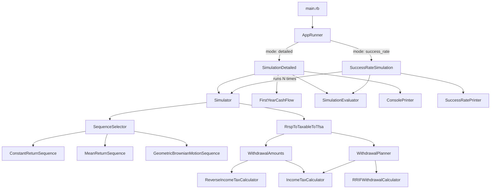

# Architecture

This document describes how the code is structured — the modules, classes, and how they connect. It's intended for contributors, or anyone who wants to extend the simulator or understand why a number came out the way it did by tracing the code path.

For a description of the *financial* mechanics (what RRIF is, how CPP interacts with tax, what GBM does), see [How It Works](how-it-works.md).

---

## Directory Structure

```
lib/
  run/                    # Entry points for each run mode
  simulation/             # Core simulation loop and success evaluator
  strategy/               # Withdrawal planning and account selection
  tax/                    # Forward and reverse income tax calculations
  return_sequences/       # Market return generators (constant, mean, GBM)
  output/                 # Console printing and formatting
  account.rb              # Account model (balance, withdraw, deposit, grow)
  app_config.rb           # Typed wrapper around inputs.yml
  withdrawal_amounts.rb   # Per-account withdrawal amount calculations
  withdrawal_rate_calculator.rb
  first_year_cash_flow.rb
  success_rate_results.rb
  numeric_formatter.rb
config/
  tax.yml                 # Current-year federal and provincial tax brackets
  tax_fixed.yml           # Fixed tax config used in tests (deterministic)
  rrif.yml                # CRA prescribed RRIF withdrawal factors by age
  rrif_fixed.yml          # Fixed RRIF config used in tests
spec/                     # RSpec tests
  fixtures/               # YAML files used as AppConfig inputs in specs
```

---

## Execution Flow



---

## Components

### Entry Points — `lib/run/`

**`AppRunner`** reads `inputs.yml`, resolves the run mode (`detailed` or `success_rate`), and delegates to the appropriate run class. The mode can be overridden via `ARGV[0]` (used by the `ruby main.rb success_rate` command).

**`SimulationDetailed`** orchestrates a single run: creates a `Simulator`, runs it, feeds the results to `SimulationEvaluator` and `FirstYearCashFlow`, then prints everything via `ConsolePrinter`.

**`SuccessRateSimulation`** runs `Simulator` N times (default 500), collects `{success, withdrawal_rate, final_balance}` from each, aggregates into `SuccessRateResults`, and prints via `SuccessRatePrinter`.

---

### Simulation Loop — `lib/simulation/`

**`Simulator`** is the core loop. On initialization it builds a `ReturnSequences::SequenceSelector` (to get market returns) and a `Strategy::RrspToTaxableToTfsa` (to manage accounts and withdrawals). For each age from `retirement_age` to `max_age`:

1. Set current age on the strategy
2. Ask `SequenceSelector` for this year's market return
3. Ask the strategy to `select_account_transactions(market_return)` — returns an array of `{account:, amount:, forced_net_excess:}` hashes, or empty array if funds are exhausted
4. Call `strategy.transact(account_transactions)` to apply the withdrawals
5. Call `strategy.apply_growth(market_return)` to grow all account balances
6. Record the yearly snapshot

The loop breaks early (returning a truncated results array) if `select_account_transactions` returns empty — this is the "ran out of money" signal.

**`SimulationEvaluator`** takes the yearly results array and determines success or failure. A run succeeds if the last recorded age equals `max_age` *and* the final total balance is at least `success_factor × desired_spending`. If the loop broke early (money ran out before `max_age`), the run fails.

---

### Withdrawal Strategy — `lib/strategy/`

**`RrspToTaxableToTfsa`** is the top-level strategy. It owns the four `Account` instances (rrsp, taxable, tfsa, cash_cushion) and a `WithdrawalAmounts` instance. Each year it decides whether to withdraw from the cash cushion or from investment accounts:

- **Cash cushion path:** if `market_return < downturn_threshold` and the cash cushion has enough balance *and* no mandatory RRIF withdrawal is required, it returns a single cash cushion transaction.
- **Normal path:** delegates to `WithdrawalPlanner` to plan investment account withdrawals.

After `transact` applies withdrawals, it handles the optional TFSA contribution deposit (skipped if the cash cushion or TFSA was used).

**`WithdrawalPlanner`** plans withdrawals from investment accounts in RRSP → Taxable → TFSA order. It attempts the plan twice if the TFSA gets touched: first with TFSA contributions included, then again without (to preserve the TFSA). If all accounts are still insufficient, it returns an empty array.

For RRSP withdrawals specifically, it handles two cases:
- **RRIF mandatory withdrawal exceeds desired withdrawal:** the mandatory amount becomes the actual gross; the after-tax excess over desired spending is recorded as `forced_net_excess` and later deposited into the taxable account.
- **RRSP partially funded:** drains the RRSP entirely and calculates the after-tax proceeds, then passes the remaining shortfall to the taxable account.

**`RRIFWithdrawalCalculator`** looks up the CRA-prescribed minimum withdrawal percentage for a given age from `config/rrif.yml` and computes the mandatory dollar amount from the current RRSP balance. Returns 0 for ages below 71.

---

### Withdrawal Amounts — `lib/withdrawal_amounts.rb`

`WithdrawalAmounts` calculates how much to withdraw from each account type, given the current age, desired spending, and whether CPP is active. This is where the per-account math lives:

- **`annual_rrsp`:** calls `ReverseIncomeTaxCalculator` to find the gross RRSP withdrawal needed to net the desired spending. If CPP is active, runs binary search (see below) because CPP and RRSP withdrawals interact in the tax calculation.
- **`annual_taxable` / `annual_tfsa` / `annual_cash_cushion`:** desired spending minus CPP net income (if CPP is active), since taxable/TFSA/cash withdrawals aren't taxed further.

**CPP binary search:** when CPP is active, the combined taxable income is `rrsp_withdrawal + cpp_gross`. The correct RRSP amount is the value where `tax(rrsp_withdrawal + cpp_gross) - rrsp_withdrawal - cpp_gross = -desired_spending`. Binary search bounds: upper = gross RRSP needed without CPP; lower = upper minus full gross CPP. Converges to within $1 in under 100 iterations.

---

### Tax — `lib/tax/`

**`IncomeTaxCalculator`** — forward calculation. Given gross income and a province code, applies progressive federal and provincial brackets with the basic personal amount exemption as a non-refundable credit. Returns `{federal_tax:, provincial_tax:, total_tax:, take_home:}`.

**`ReverseIncomeTaxCalculator`** — reverse calculation. Given desired take-home and a province code, finds the gross income via binary search (bounds: `desired_take_home` to `desired_take_home × 1.5`, tolerance $0.01). Uses the same progressive bracket logic internally.

Both calculators load from `config/tax.yml` in production, or `config/tax_fixed.yml` when `ENV["APP_ENV"] == "test"` — allowing tests to use stable, known rates rather than rates that change each tax year.

---

### Return Sequences — `lib/return_sequences/`

**`SequenceSelector`** reads the `return_sequence_type` config key and instantiates the appropriate class. All sequences receive `retirement_age`, `max_age`, `average`, `min`, and `max` on initialization and respond to `get_return_for_age(age)`.

**`ConstantReturnSequence`** — returns `average` every year.

**`MeanReturnSequence`** — generates a random sequence pre-shuffled to average out to the target over the full simulation.

**`GeometricBrownianMotionSequence`** — generates an independent random return each year. Each return is `exp(drift + sigma × shock) - 1` where:
- `drift` = `log(1 + average) - 0.5 × sigma²` (Itô correction to prevent drift above intended average)
- `sigma` = derived from `min`/`max` via three-sigma rule: `(max - min) / 6`
- `shock` = drawn from a Student-t distribution (df=10) for fat tails

---

### Output — `lib/output/`

**`ConsolePrinter`** formats and prints the detailed run: summary header, first-year cash flow analysis, the year-by-year table, and the evaluator verdict.

**`SuccessRatePrinter`** formats the Monte Carlo summary: success rate percentage, average final balance, and the percentile distribution table.

**`ConsolePlotter`** renders small ASCII sparkline-style charts used in some output views.

---

### Support Classes

**`Account`** holds a balance and supports `withdraw(amount)`, `deposit(amount)`, and `apply_growth(rate)`. Cash cushion accounts use a separate savings rate rather than the market return.

**`AppConfig`** wraps the `inputs.yml` hash with typed accessors (`accounts`, `cpp`, `taxes`, `annual_growth_rate`). Accepts either a file path string or a hash directly (used in tests to pass fixture hashes inline).

**`FirstYearCashFlow`** calculates the withholding tax gap in the first year of RRSP withdrawals — the difference between what the bank withholds (30%) and what you'll actually owe (~15%), and the expected refund timing.

**`SuccessRateResults`** aggregates an array of per-run results and computes success rate, mean final balance, and percentile breakdowns.

**`WithdrawalRateCalculator`** computes the initial withdrawal rate (desired spending / total starting balance) for display purposes.

---

## Config Files

| File | Purpose |
|---|---|
| `config/tax.yml` | Current-year federal and provincial tax brackets, rates, and basic personal amount exemptions |
| `config/tax_fixed.yml` | Frozen tax config used in tests for determinism |
| `config/rrif.yml` | CRA-prescribed minimum RRIF withdrawal factors by age (71–95+) |
| `config/rrif_fixed.yml` | Frozen RRIF config used in tests |
| `inputs.yml` | User's financial inputs (gitignored; copy from `inputs.yml.template`) |

---

## Testing

Tests live in `spec/`. Run them with `bin/rspec`.

- **Unit tests** test individual calculators in isolation. Tax tests use `APP_ENV=test` (set automatically by `spec/spec_helper.rb`) to switch to `tax_fixed.yml` / `rrif_fixed.yml` so results don't change when tax brackets are updated.
- **Integration-style specs** use YAML fixtures in `spec/fixtures/` as `AppConfig` inputs.
- **`lib/run/`** is excluded from SimpleCov coverage (thin orchestration layer, tested end-to-end by `bin/ci` which runs both `main.rb` modes).
- **`bin/ci`** runs rubocop + rspec + both `main.rb` invocations as the full local CI check.
